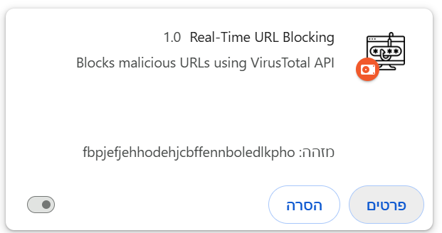
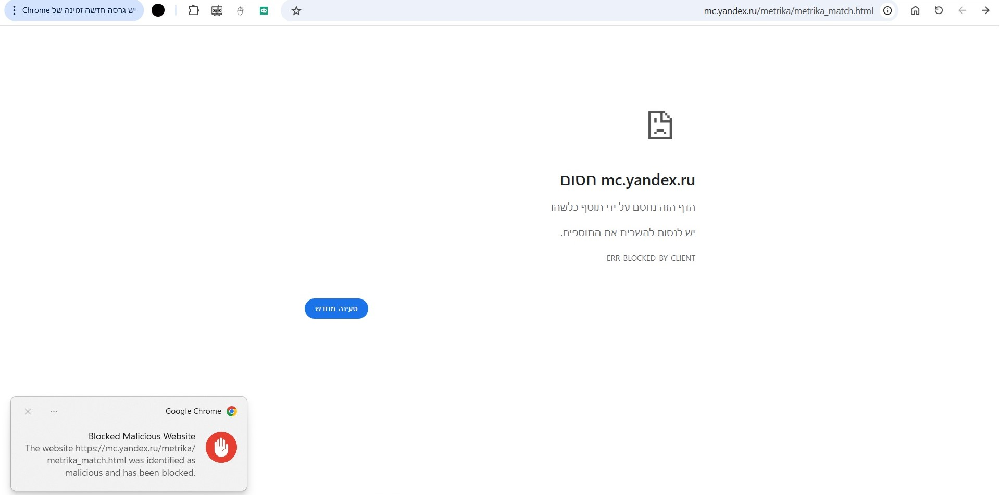

# Real-Time URL Blocking - Chrome Extension 
### About
This is a chrome extension that monitors urls the user wants to visit in real time. if a malicious url is detected the extention will block it and alert the user. 

### Technologies 
- Chrome Extensions API
- VirusTotal API

### The extension

### Install instructions 
1. Clone or download the extension from this repository.
2. Open Chrome and go to `chrome://extensions/`.
3. Enable **Developer mode**.
4. Click on **Load unpacked** and select the folder containing the extension files.
5. You may pin the extension in your toolbar for your conviniency 

**Enjoy!**

